# Recherche dans des données compressées

* [@llm](./_search1.llm.md)

## Références

* [FM-index {wiki}](https://fr.wikipedia.org/wiki/FM-index)
* [Range query {tutorialspoint}](https://www.tutorialspoint.com/data_structures_algorithms/range_queries.htm)
* [Range query {wiki}](https://en.wikipedia.org/wiki/Range_query_(computer_science))

## Qualités

* Recherche de plages ou recherche par sélection de critères \
  C'est-à-dire que l'on connaît un critère sur la donnée recherché permettant d'exclure rapidement beaucoup de donnée
* ...

## Range query data structures

* [Segment Trees {en:wiki}](https://en.wikipedia.org/wiki/Segment_tree)/[Arbre de segments {fr:wiki}](https://fr.wikipedia.org/wiki/Arbre_de_segments)
* [Fenwick Trees / Binary Indexed Trees](https://en.wikipedia.org/wiki/Fenwick_tree)
* [Priority Search Trees](https://en.wikipedia.org/wiki/Priority_search_tree)
* kd-Trees
* [Binary space partitioning {en:wiki}](https://en.wikipedia.org/wiki/Binary_space_partitioning)
* Interval Trees
* Range Trees
* Wavelet Trees
* Quad Trees

<!--  -->

Tel que [A, B, C, D, E, F, G, H] sont de structures de données

## FM-index
